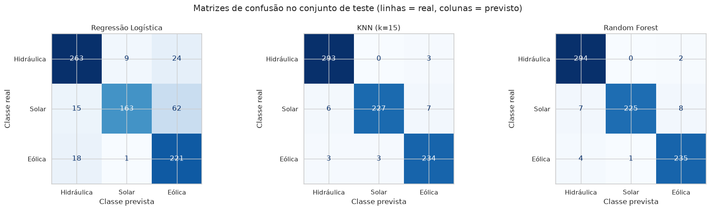
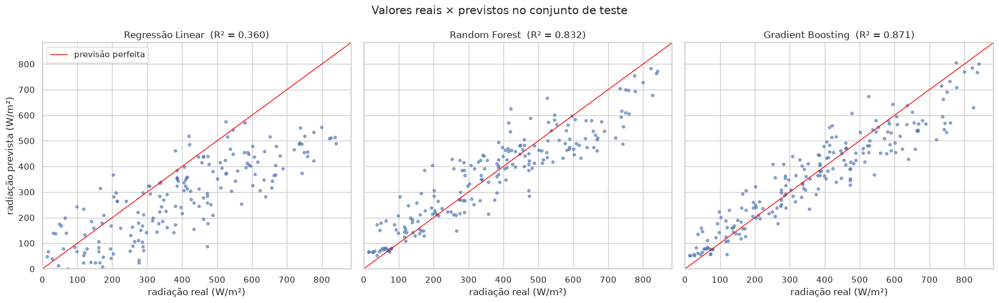
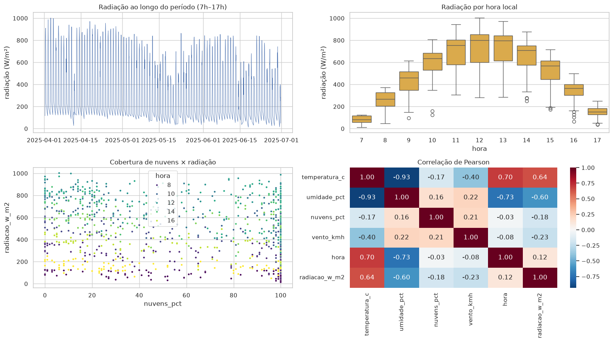
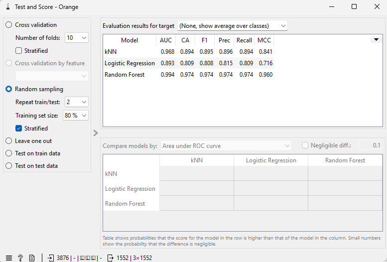
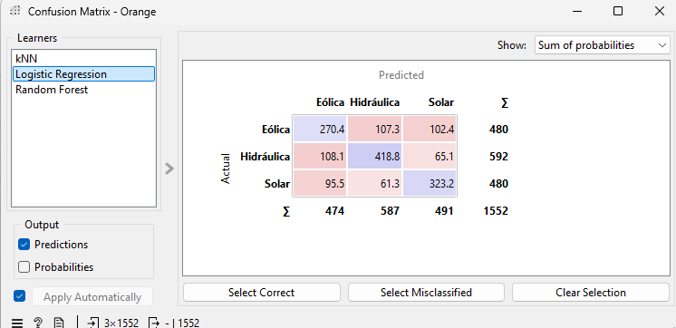
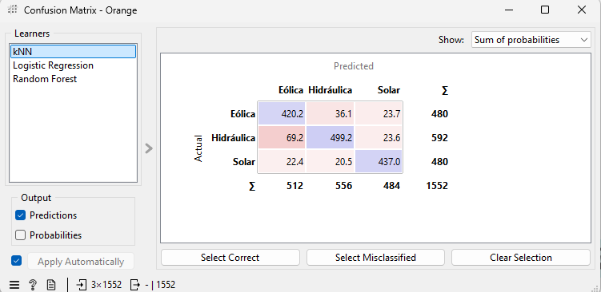
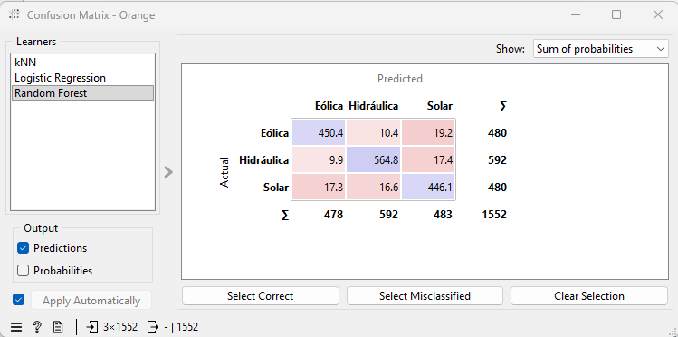

# CP02 — APIs, energias renováveis e aprendizado de máquina

## Participantes/RMs

| Nome | RM |
|---|---|
| Vitor Nascimento | 571873 |
| Lucas Santana | 573197 |
| Pierre Biason | 569718 |
| João Pedro Ferrari | 573037 |
| Lucca Bracco | 570175 |
| Nikkolas Korner | 569655 |

## Objetivo

Consultar duas APIs públicas de dados de energia e clima, gerar dois conjuntos de dados em CSV e resolver duas tarefas independentes de aprendizado de máquina em Python, comparando **três algoritmos em cada uma**:

1. **Classificação:** prever a fonte de um empreendimento de geração (**Solar, Eólica ou Hidráulica**) a partir da potência outorgada e da localização.
2. **Regressão:** estimar a **radiação solar global horizontal** (W/m²) em Petrolina (PE) a partir de variáveis meteorológicas e da hora local.

O notebook parte do notebook de apoio da disciplina ([`Aula_APIs_Energia_Renovavel_ML.ipynb`](https://github.com/prof-atritiack/CHECKPOINT_02_SERS_1CC_2SEM)). As células de consulta às APIs e de geração dos CSVs foram mantidas. As bibliotecas, a análise exploratória, os seis modelos, as métricas, os gráficos e as interpretações foram acrescentados.

## Conteúdo do repositório

| Arquivo | Descrição |
|---|---|
| `CP02_Energia_Renovavel_ML.ipynb` | Notebook completo e já executado: consulta às APIs, geração dos CSVs, análise, 6 modelos, métricas, gráficos e interpretação |
| `aneel_classificacao_orange.csv` | Dados da Tarefa 1, gerados pela API da ANEEL (3.876 linhas) |
| `meteo_regressao_orange.csv` | Dados da Tarefa 2, gerados pela API Open-Meteo (1.001 linhas) |
| `figuras/` | Gráficos exportados do notebook |
| `orange/` | Capturas de tela da atividade complementar no Orange Data Mining |
| `requirements.txt` | Bibliotecas necessárias |

## Origem e período dos dados

| | Tarefa 1 — Classificação | Tarefa 2 — Regressão |
|---|---|---|
| **Fonte** | [ANEEL — SIGA](https://dadosabertos.aneel.gov.br/dataset/siga-sistema-de-informacoes-de-geracao-da-aneel) (API CKAN `datastore_search`, recurso `11ec447d-698d-4ab8-977f-b424d5deee6a`) | [Open-Meteo — API histórica](https://open-meteo.com/en/docs/historical-weather-api) (`archive-api.open-meteo.com/v1/archive`) |
| **Recorte** | Siglas `UFV` (Solar), `EOL` (Eólica), `UHE`/`PCH`/`CGH` (Hidráulica); até 1.200 registros por sigla | Petrolina (PE), lat −9,39, lon −40,50, fuso `America/Recife` |
| **Período** | Cadastro vigente no momento da consulta (empreendimentos em diferentes fases) | 01/04/2025 a 30/06/2025, horas locais das 7h às 17h |
| **Entradas** | `potencia_kw`, `latitude`, `longitude` | `temperatura_c`, `umidade_pct`, `nuvens_pct`, `vento_kmh`, `hora` |
| **Alvo** | `fonte` | `radiacao_w_m2` |
| **Observação** | Potência outorgada **não** é energia gerada | Dados de modelo/reanálise, **não** de um painel fotovoltaico |

Nenhuma das consultas exige token ou senha, e nenhuma credencial é publicada neste repositório.

## Como executar

```bash
git clone https://github.com/luccabracco/CP02_SERS.git
cd CP02_SERS
python -m venv .venv
source .venv/bin/activate          # Windows: .venv\Scripts\activate
pip install -r requirements.txt
jupyter notebook CP02_Energia_Renovavel_ML.ipynb
```

Execute as células **em ordem** (*Kernel → Restart & Run All*). O notebook consulta as APIs, **regrava os dois CSVs** na pasta do projeto e, em seguida, treina e avalia os modelos. Ele também funciona no Google Colab. Execução validada com Python 3.11, pandas 3.0, scikit-learn 1.9, matplotlib 3.11 e seaborn 0.13.

**Para reproduzir apenas os CSVs:** execute as células das seções *"O que é recebido da API?"* (imports e `consultar_api`), *"1. Consultar a ANEEL"*, *"2. Gerar o CSV para a tarefa"*, *"3. Consultar o histórico meteorológico"* e *"4. Gerar o CSV horário"*.

Duas alterações foram feitas nessas células:

- **Novas tentativas de conexão:** a função `consultar_api` repete a consulta até 5 vezes em caso de **falha temporária de conexão**, porque o servidor da ANEEL às vezes encerra a conexão.
- **Alternativa para a Open-Meteo:** a Open-Meteo gratuita tem um **limite diário de requisições por IP** (erro HTTP 429). Se ela estiver indisponível, o notebook busca as mesmas variáveis na [API NASA POWER](https://power.larc.nasa.gov/docs/services/api/temporal/hourly/), que também é pública e sem token, e informa na saída qual fonte usou. **Nos resultados publicados aqui a Open-Meteo respondeu normalmente**, portanto o CSV e as métricas abaixo vêm da fonte original pedida no enunciado.

## Configuração de avaliação

| | Tarefa 1 — Classificação | Tarefa 2 — Regressão |
|---|---|---|
| **Divisão** | Holdout **estratificado** 80% / 20% (`random_state=42`): 3.100 treino / 776 teste | **Temporal**, sem embaralhar: primeiras 80% das horas (800, 01/04 a 12/06) no treino, últimas 20% (201, 12/06 a 30/06) no teste |
| **Pré-processamento** | `log1p(potência)` + `StandardScaler` em `Pipeline` (ajustados só no treino) para Regressão Logística e KNN | `StandardScaler` em `Pipeline` (ajustado só no treino) para a Regressão Linear |
| **Métricas** | Accuracy, Precision, Recall e F1 com **média `macro`** (F1 `weighted` como complemento) + matriz de confusão | MAE (W/m²), MSE ((W/m²)²) e R² + gráfico real × previsto |
| **Linha de base** | Classe mais frequente: Accuracy 0,381 | Média do treino: MAE 209,0 W/m² |

Os três algoritmos de cada tarefa usam **exatamente a mesma divisão** de treino e teste.

## Resultados e conclusões

### Tarefa 1 — Classificação da fonte (ANEEL)

| Algoritmo | Accuracy | Precision (macro) | Recall (macro) | F1 (macro) | F1 (weighted) |
|---|---|---|---|---|---|
| **Random Forest** (300 árvores) | **0,972** | **0,973** | **0,970** | **0,971** | **0,972** |
| KNN (k = 15, pesos por distância) | 0,972 | 0,972 | 0,970 | 0,971 | 0,972 |
| Regressão Logística (multinomial) | 0,834 | 0,850 | 0,830 | 0,829 | 0,833 |



- **Modelo escolhido: Random Forest.** Ele empata com o KNN, não depende de escala nem de uma métrica de distância e indica a importância das variáveis: latitude 0,38, potência 0,31 e longitude 0,30.
- **Classes mais confundidas:** a **Solar** tem o menor recall (0,94).
  - Usinas solares de 18 a 48 MW no interior do Nordeste são previstas como **Eólica**: mesma região e mesma faixa de potência dos parques eólicos.
  - Usinas solares pequenas no Sudeste, no Sul e no Centro-Oeste são previstas como **Hidráulica**, porque ficam em regiões e portes típicos de PCHs e CGHs.
  - Na Regressão Logística, a confusão dominante é Solar → Eólica (62 casos): uma fronteira linear não separa essas classes.
- **As métricas são otimistas por causa da amostra.** A API retorna as **primeiras** 1.200 usinas solares de um total de 18.980, e não uma amostra aleatória. Dessas, 753 têm exatamente 1 kW e ficam concentradas em um mesmo ponto da Região Norte. Além disso, 47 registros eólicos ou hidráulicos têm coordenada igual a 0 (localização ausente). Esses casos atípicos são acertados em 97–100% das vezes. Nos registros típicos, o F1 macro cai para ≈ 0,95 no Random Forest e no KNN e para ≈ 0,60 na Regressão Logística.
- **Limitações:** a mesma região abriga várias fontes, e as faixas de potência se sobrepõem. O cadastro também mistura fases diferentes e tem coordenadas aproximadas. O modelo aprende padrões geográficos da amostra, não uma característica física da tecnologia. Para generalizar, precisaria de atributos como o recurso solar ou eólico local, o relevo e a bacia hidrográfica. As quantidades por classe **não** representam a participação das fontes na matriz energética brasileira.

### Tarefa 2 — Regressão da radiação solar (Open-Meteo, Petrolina-PE)

| Algoritmo | MAE (W/m²) | MSE ((W/m²)²) | R² |
|---|---|---|---|
| **Gradient Boosting** (`HistGradientBoostingRegressor`) | **59,9** | **6.072** | **0,871** |
| Random Forest (300 árvores) | 69,3 | 7.860 | 0,832 |
| Regressão Linear | 145,2 | 30.034 | 0,360 |



- **Melhor modelo: Gradient Boosting**, com erro médio de ~60 W/m² e 87% da variância explicada no período de teste. A Regressão Linear não representa a curva em sino da radiação ao longo do dia nem a interação entre hora e nuvens.
- **Papel da hora:** a hora define a altura do Sol e, portanto, o máximo de radiação possível naquele momento. As variáveis meteorológicas, principalmente as nuvens, explicam o quanto a radiação fica abaixo desse máximo.
  - A correlação linear da hora com a radiação é só +0,12, porque a relação tem forma de sino. Mesmo assim, retirar a hora faz o Random Forest cair de R² 0,83 para 0,34.
  - O erro é menor às 7h e às 17h (21 e 36 W/m²) e maior entre 10h e 14h (74–90 W/m²).
- **Erros:** o período de teste (segunda quinzena de junho) é mais nublado (68% contra 52% de nuvens em média) e tem radiação média menor (373 contra 498 W/m²) do que o treino, o que exige extrapolação. A cobertura de nuvens em % também não descreve a espessura das nuvens.
- **Radiação não é geração elétrica:** o alvo é a irradiância horizontal média em W/m², ou seja, potência por área, estimada por modelo. A energia (kWh) de um sistema fotovoltaico depende também da área, da inclinação e da orientação dos módulos; da eficiência e da perda por temperatura; das perdas no inversor, no cabeamento e por sujeira e sombreamento; e da disponibilidade do sistema. Estimar a radiação é apenas uma das etapas de um modelo de geração.



## Atividade complementar — Orange Data Mining

### Classificação (ANEEL)

**Fluxo:** File (`aneel_classificacao_orange.csv`) → Select Columns (features `potencia_kw`, `latitude`, `longitude`; target `fonte`) → **kNN**, **Logistic Regression** e **Random Forest** → Test and Score → Confusion Matrix.

**Avaliação no Test and Score:** *Random sampling*, **2 repetições**, treino de **80%**, **estratificado**. As mesmas divisões foram usadas para os três modelos. Os três algoritmos são os mesmos do notebook. Com *Target class* em "(None, show average over classes)", o Orange calcula Precision, Recall e F1 como **média ponderada pelo tamanho das classes (weighted)**.

| Algoritmo | AUC | CA (Accuracy) | F1 | Precision | Recall | MCC |
|---|---|---|---|---|---|---|
| **Random Forest** | **0,994** | **0,974** | **0,974** | **0,974** | **0,974** | **0,960** |
| kNN | 0,968 | 0,894 | 0,895 | 0,896 | 0,894 | 0,841 |
| Logistic Regression | 0,893 | 0,809 | 0,808 | 0,815 | 0,809 | 0,716 |



| Logistic Regression | kNN | Random Forest |
|---|---|---|
|  |  |  |

As matrizes de confusão somam as 2 repetições (1.552 previsões = 2 × 776) e estão no modo *Sum of probabilities*. Por isso os valores são decimais.

**Análise dos três resultados**

- **Random Forest** é o melhor modelo também no Orange, com CA 0,974, F1 0,974 e AUC 0,994. O resultado é praticamente igual ao do notebook (0,972), porque árvores não dependem da escala das variáveis. Os erros estão espalhados e são pequenos, em torno de 10 a 19 por par de classes.
- **kNN** fica bem abaixo do notebook (0,894 × 0,972), e a maior confusão é **Hidráulica → Eólica** (69). A diferença provavelmente vem do pré-processamento. O Orange padroniza a potência **bruta**, que vai de menos de 1 kW a mais de 11 GW, então quase todos os valores ficam comprimidos perto de zero e a distância passa a depender quase só da latitude e da longitude. No notebook, a potência passou por `log1p` antes da padronização e voltou a separar as classes.
- **Logistic Regression** é o pior modelo (CA 0,809), com confusão entre todas as classes, principalmente **Eólica ↔ Hidráulica** (~108 em cada sentido) e **Eólica ↔ Solar** (~95 a 102). Uma fronteira linear em potência, latitude e longitude não separa bem fontes que ocupam as mesmas regiões e faixas de potência.
- **Comparação com o notebook:** a ordem dos modelos é a mesma (Random Forest ≥ kNN > Regressão Logística). Os números não são idênticos porque as divisões sorteadas são diferentes, o Orange usou 2 repetições e média *weighted*, e o pré-processamento do kNN e da regressão logística é diferente. A limitação discutida na Tarefa 1 continua valendo: parte do acerto vem do aglomerado de usinas solares de 1 kW na amostra da API.

